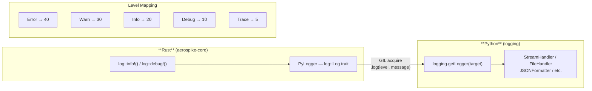

# Logging

aerospike-py includes a built-in **Rust-to-Python logging bridge** that forwards all internal Rust logs to Python's standard `logging` module. This means you can observe Aerospike client internals using the same logging configuration as the rest of your application.

## Architecture



The bridge is initialized automatically when the module is imported. No extra setup is required.

## Quick Start

```python
import logging
import aerospike_py

# Enable debug-level output for aerospike-py
logging.basicConfig(level=logging.DEBUG)

client = aerospike_py.client({"hosts": [("127.0.0.1", 3000)]}).connect()
client.put(("test", "demo", "key1"), {"name": "Alice"})
```

Output:

```
DEBUG:aerospike_core::cluster: Connecting to seed 127.0.0.1:3000
DEBUG:aerospike_core::cluster: Node added: BB9...
DEBUG:aerospike_core::batch: put completed in 1.2ms
```

## Log Levels

Use `set_log_level()` or the `LOG_LEVEL_*` constants to control verbosity:

```python
import aerospike_py

# Using constants
aerospike_py.set_log_level(aerospike_py.LOG_LEVEL_DEBUG)
```

| Constant | Value | Python Level | Description |
|---|---|---|---|
| `LOG_LEVEL_OFF` | -1 | — | Disable all logging |
| `LOG_LEVEL_ERROR` | 0 | `ERROR` (40) | Errors only |
| `LOG_LEVEL_WARN` | 1 | `WARNING` (30) | Warnings and above |
| `LOG_LEVEL_INFO` | 2 | `INFO` (20) | Informational messages |
| `LOG_LEVEL_DEBUG` | 3 | `DEBUG` (10) | Detailed debugging |
| `LOG_LEVEL_TRACE` | 4 | `TRACE` (5) | Wire-level tracing |

`set_log_level()` configures both Rust internal loggers and the Python-side `aerospike_py` logger simultaneously.

## Logger Names

Rust log targets map directly to Python logger names. The main loggers you'll see:

| Logger Name | Description |
|---|---|
| `aerospike_core::cluster` | Cluster discovery, node management |
| `aerospike_core::batch` | Batch operation execution |
| `aerospike_core::command` | Individual command execution |
| `aerospike_py` | Python-side client wrapper |

You can configure each independently:

```python
import logging

# Only show cluster-level events
logging.getLogger("aerospike_core::cluster").setLevel(logging.DEBUG)
logging.getLogger("aerospike_core::batch").setLevel(logging.WARNING)
```

## Structured JSON Logging

For production environments, use a JSON formatter to produce machine-readable logs:

```python
import logging
import json

class JSONFormatter(logging.Formatter):
    def format(self, record):
        return json.dumps({
            "timestamp": self.formatTime(record),
            "level": record.levelname,
            "logger": record.name,
            "message": record.getMessage(),
        })

handler = logging.StreamHandler()
handler.setFormatter(JSONFormatter())

logger = logging.getLogger("aerospike_core")
logger.addHandler(handler)
logger.setLevel(logging.DEBUG)
```

Output:

```json
{"timestamp": "2025-01-15 10:30:00,123", "level": "DEBUG", "logger": "aerospike_core::cluster", "message": "Connecting to seed 127.0.0.1:3000"}
```

## Framework Integration

### FastAPI

```python
import logging
from contextlib import asynccontextmanager

import aerospike_py
from fastapi import FastAPI

logging.basicConfig(
    level=logging.INFO,
    format="%(asctime)s %(name)s %(levelname)s %(message)s",
)

@asynccontextmanager
async def lifespan(app: FastAPI):
    aerospike_py.set_log_level(aerospike_py.LOG_LEVEL_INFO)
    client = aerospike_py.AsyncClient({"hosts": [("127.0.0.1", 3000)]})
    await client.connect()
    app.state.aerospike = client
    yield
    await client.close()

app = FastAPI(lifespan=lifespan)
```

### Django

```python
# settings.py
LOGGING = {
    "version": 1,
    "handlers": {
        "console": {"class": "logging.StreamHandler"},
    },
    "loggers": {
        "aerospike_core": {
            "handlers": ["console"],
            "level": "INFO",
        },
        "aerospike_py": {
            "handlers": ["console"],
            "level": "INFO",
        },
    },
}
```

## File Logging

Route Aerospike logs to a separate file:

```python
import logging

file_handler = logging.FileHandler("aerospike.log")
file_handler.setFormatter(
    logging.Formatter("%(asctime)s %(levelname)s %(name)s %(message)s")
)

for name in ["aerospike_core", "aerospike_py"]:
    logger = logging.getLogger(name)
    logger.addHandler(file_handler)
    logger.setLevel(logging.DEBUG)
```

## Disabling Logs

To suppress all Aerospike logging:

```python
aerospike_py.set_log_level(aerospike_py.LOG_LEVEL_OFF)
```

Or with standard Python logging:

```python
logging.getLogger("aerospike_core").setLevel(logging.CRITICAL + 1)
logging.getLogger("aerospike_py").setLevel(logging.CRITICAL + 1)
```
