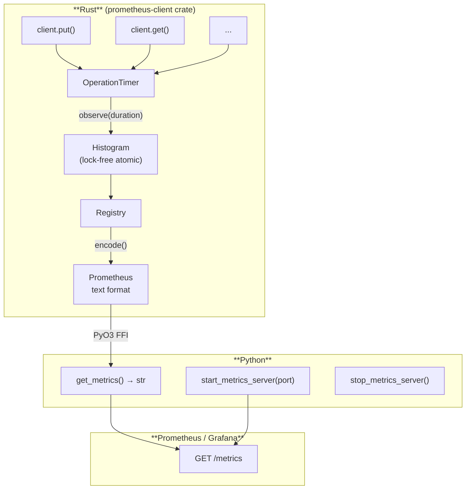

# Prometheus Metrics

aerospike-py collects operation-level metrics in Rust and exposes them in **Prometheus text format**. Metric names and labels follow [OpenTelemetry DB Client Semantic Conventions](https://opentelemetry.io/docs/specs/semconv/database/), making them compatible with standard observability stacks.

## Architecture



Metrics recording uses **lock-free atomic operations** in the hot path. The `Mutex` is only acquired when encoding text for scraping, which has negligible impact at typical 15–30 second scrape intervals.

## Available Metrics

### `db_client_operation_duration_seconds`

A **histogram** tracking the duration of every data operation.

| Label | Description | Examples |
|---|---|---|
| `db_system_name` | Always `"aerospike"` | `aerospike` |
| `db_namespace` | Aerospike namespace | `test`, `production` |
| `db_collection_name` | Aerospike set name | `users`, `sessions` |
| `db_operation_name` | Operation type | `get`, `put`, `delete`, `query`, `scan` |
| `error_type` | Empty on success, error classification on failure | `""`, `Timeout`, `KeyNotFoundError` |

**Histogram buckets:** `0.001, 0.005, 0.01, 0.05, 0.1, 0.5, 1.0, 5.0, 10.0` seconds

**Instrumented operations:**

| Operation | `db_operation_name` |
|---|---|
| `put` | `put` |
| `get` | `get` |
| `select` | `select` |
| `exists` | `exists` |
| `remove` / `delete` | `remove` |
| `touch` | `touch` |
| `append` | `append` |
| `prepend` | `prepend` |
| `increment` | `increment` |
| `operate` | `operate` |
| `batch_read` | `batch_read` |
| `batch_operate` | `batch_operate` |
| `batch_remove` | `batch_remove` |
| `Query.results()` | `query` |
| `Scan.results()` / `Scan.foreach()` | `scan` |

**Error types:**

| `error_type` | Cause |
|---|---|
| `""` (empty) | Success |
| `Timeout` | Operation timed out |
| `Connection` | Network connection failure |
| `KeyNotFoundError` | Record does not exist |
| `KeyExistsError` | Record already exists (create-only) |
| `GenerationError` | Optimistic lock conflict |
| `FilteredOut` | Expression filter excluded the record |
| `InvalidArgument` | Invalid parameters |

:::tip[exists() special handling]
`exists()` treats `KeyNotFoundError` as a **success** (empty `error_type`) since a "not found" result is a normal outcome for existence checks.
:::

## Quick Start

### Get metrics as string

```python
import aerospike_py

text = aerospike_py.get_metrics()
print(text)
```

Output (even before any operations):

```
# HELP db_client_operation_duration_seconds Duration of database client operations.
# TYPE db_client_operation_duration_seconds histogram
# EOF
```

### Built-in metrics server

Start a lightweight HTTP server on a background thread:

```python
aerospike_py.start_metrics_server(port=9464)
# Prometheus scrapes http://localhost:9464/metrics
```

Stop it when no longer needed:

```python
aerospike_py.stop_metrics_server()
```

## Framework Integration

### FastAPI

Combine Aerospike metrics with your application's own Python `prometheus_client` metrics:

```python
from fastapi import FastAPI, Response
from prometheus_client import Counter, generate_latest, REGISTRY
import aerospike_py

app = FastAPI()

REQUEST_COUNT = Counter(
    "http_requests_total", "Total HTTP requests", ["method", "path"]
)

@app.get("/metrics")
def metrics():
    # Python app metrics
    python_metrics = generate_latest(REGISTRY).decode("utf-8")
    # Aerospike Rust metrics
    aerospike_metrics = aerospike_py.get_metrics()
    # Combine both
    combined = python_metrics + "\n" + aerospike_metrics
    return Response(combined, media_type="text/plain; version=0.0.4")
```

```bash
pip install prometheus-client
```

### Django

Use the built-in metrics server alongside Django:

```python
# myproject/apps.py
from django.apps import AppConfig
import aerospike_py

class MyAppConfig(AppConfig):
    name = "myapp"

    def ready(self):
        aerospike_py.start_metrics_server(port=9464)
```

### Standalone Script

For batch jobs or CLI tools:

```python
import aerospike_py

aerospike_py.start_metrics_server(port=9464)

client = aerospike_py.client({"hosts": [("127.0.0.1", 3000)]}).connect()
for i in range(1000):
    client.put(("test", "demo", f"key{i}"), {"value": i})

# Metrics are available at http://localhost:9464/metrics
# Keep the process alive or call stop_metrics_server() to clean up
input("Press Enter to exit...")
aerospike_py.stop_metrics_server()
```

## Prometheus Configuration

Add a scrape target to `prometheus.yml`:

```yaml
scrape_configs:
  - job_name: "aerospike-py"
    scrape_interval: 15s
    static_configs:
      - targets: ["localhost:9464"]
```

Or, if using the FastAPI combined endpoint:

```yaml
scrape_configs:
  - job_name: "my-app"
    scrape_interval: 15s
    metrics_path: /metrics
    static_configs:
      - targets: ["localhost:8000"]
```

## Useful PromQL Queries

### Average operation latency (last 5 minutes)

```promql
rate(db_client_operation_duration_seconds_sum[5m])
/
rate(db_client_operation_duration_seconds_count[5m])
```

### P99 latency by operation

```promql
histogram_quantile(0.99,
  rate(db_client_operation_duration_seconds_bucket[5m])
)
```

### Error rate by type

```promql
sum by (error_type) (
  rate(db_client_operation_duration_seconds_count{error_type!=""}[5m])
)
```

### Operations per second by namespace

```promql
sum by (db_namespace, db_operation_name) (
  rate(db_client_operation_duration_seconds_count[1m])
)
```

## Grafana Dashboard

A basic dashboard with four panels:

| Panel | PromQL | Visualization |
|---|---|---|
| Ops/sec | `sum(rate(db_client_operation_duration_seconds_count[1m])) by (db_operation_name)` | Time series |
| P50/P95/P99 Latency | `histogram_quantile(0.5\|0.95\|0.99, rate(..._bucket[5m]))` | Time series |
| Error Rate | `sum(rate(..._count{error_type!=""}[1m])) by (error_type)` | Time series |
| Ops by Namespace | `sum(rate(..._count[1m])) by (db_namespace)` | Pie chart |

## Performance Impact

| Scenario | Overhead |
|---|---|
| Per-operation recording | ~30–80 ns (atomic increment) |
| Relative to Aerospike round-trip | 0.001–0.01% |
| `get_metrics()` encoding | ~50–200 us |

Metrics collection is always enabled. The overhead is negligible compared to network I/O.
