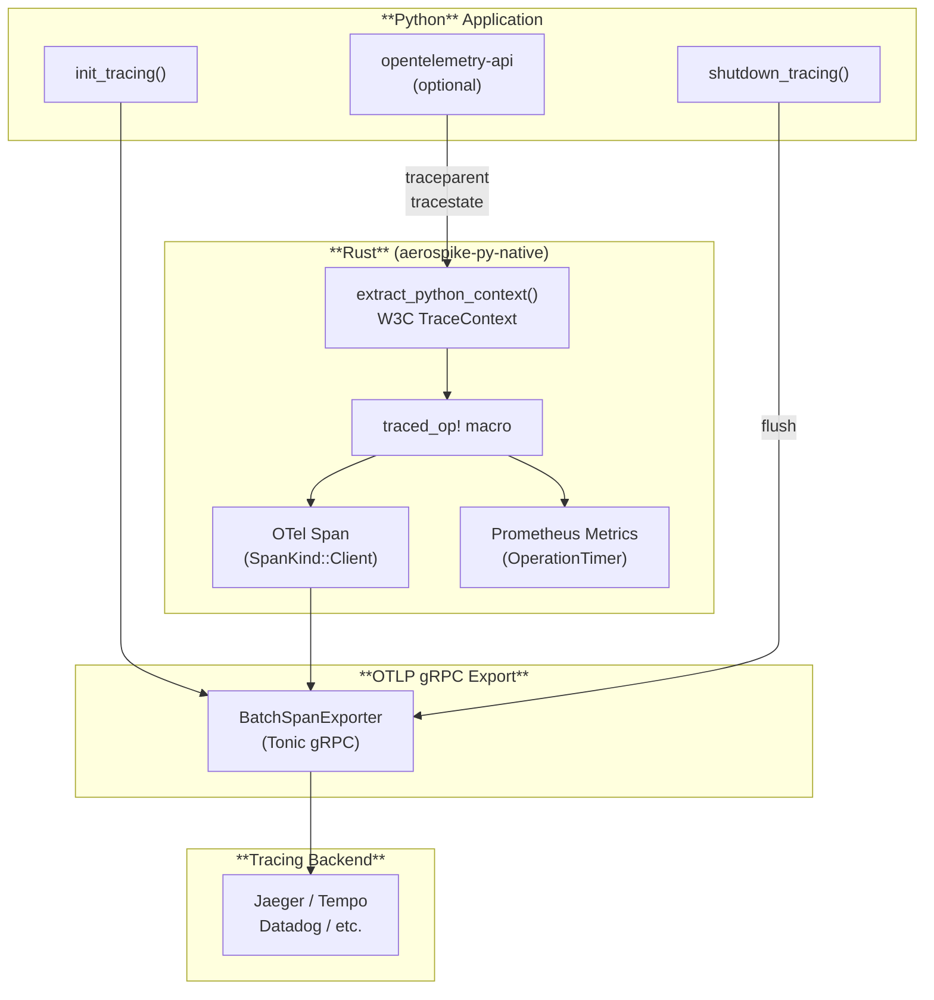
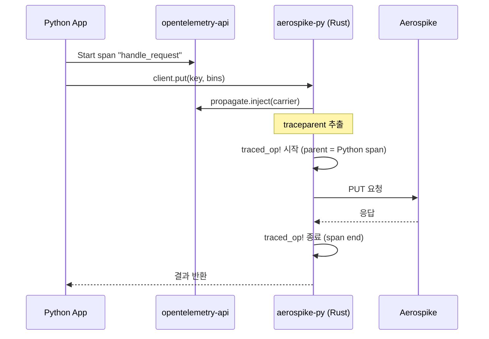

# Distributed Tracing

aerospike-py provides built-in **distributed tracing** based on [OpenTelemetry](https://opentelemetry.io/) 0.28. Every data operation (put, get, delete, query, scan, ...) is automatically wrapped in an OTel span, following the [Database Client Semantic Conventions](https://opentelemetry.io/docs/specs/semconv/database/). Spans are exported via **OTLP gRPC** and can be visualized in Jaeger, Tempo, Datadog, or any OTel-compatible backend.

## Architecture



Tracing과 Prometheus 메트릭은 `traced_op!` 매크로에서 **동시에** 기록됩니다. 별도의 설정 없이 하나의 코드 경로에서 span과 histogram이 함께 생성됩니다.

## Quick Start

### 설치

```bash
pip install aerospike-py
```

Tracing 기능(OTLP exporter, span 생성)은 빌드 시 **기본 내장**되어 있어 추가 설치가 필요 없습니다.

Python 애플리케이션의 span과 Aerospike span을 연결하는 **distributed context propagation**이 필요한 경우에만 `opentelemetry-api`를 추가 설치합니다:

```bash
pip install aerospike-py[otel]  # opentelemetry-api 추가 설치
```

### 기본 사용법

```python
import aerospike_py

# 1. OTel tracing 초기화 (OTEL_* 환경변수 자동 읽기)
aerospike_py.init_tracing()

# 2. 클라이언트 사용 — 모든 데이터 작업이 자동으로 트레이싱됨
client = aerospike_py.client({"hosts": [("127.0.0.1", 3000)]}).connect()
client.put(("test", "users", "user1"), {"name": "Alice", "age": 30})
record = client.get(("test", "users", "user1"))
client.close()

# 3. 프로세스 종료 전 pending span flush
aerospike_py.shutdown_tracing()
```

## Python API

| Function | Description |
|---|---|
| `aerospike_py.init_tracing()` | OTLP tracer provider 초기화. `OTEL_*` 환경변수 자동 적용. |
| `aerospike_py.shutdown_tracing()` | Tracer provider 종료 및 pending span flush. 프로세스 종료 전 반드시 호출. |

두 함수 모두 **thread-safe**하며 중복 호출해도 안전합니다.

## 환경변수

모든 설정은 표준 OpenTelemetry 환경변수로 제어됩니다. 별도의 코드 기반 설정 API는 없습니다.

| Variable | Default | Description |
|---|---|---|
| `OTEL_EXPORTER_OTLP_ENDPOINT` | `http://localhost:4317` | OTLP gRPC endpoint |
| `OTEL_SERVICE_NAME` | `aerospike-py` | 서비스 이름 (resource attribute) |
| `OTEL_SDK_DISABLED` | `false` | `true`로 설정 시 tracing 완전 비활성화 |
| `OTEL_TRACES_EXPORTER` | `otlp` | `none`으로 설정 시 export 비활성화 |

:::tip[대소문자 구분 없음]
`OTEL_SDK_DISABLED`와 `OTEL_TRACES_EXPORTER`의 값은 대소문자를 구분하지 않습니다. `true`, `True`, `TRUE` 모두 동일하게 동작합니다.
:::

## Span Attributes

모든 span은 [OTel Database Semantic Conventions](https://opentelemetry.io/docs/specs/semconv/database/)을 따릅니다.

| Attribute | Description | Example |
|---|---|---|
| `db.system.name` | 항상 `"aerospike"` | `aerospike` |
| `db.namespace` | Aerospike namespace | `test`, `production` |
| `db.collection.name` | Aerospike set name | `users`, `sessions` |
| `db.operation.name` | 오퍼레이션 종류 (대문자) | `PUT`, `GET`, `REMOVE` |

**Span name format:** `{OPERATION} {namespace}.{set}` (예: `PUT test.users`)

**Span kind:** `SpanKind.CLIENT`

### Error Attributes

오퍼레이션 실패 시 span에 추가 속성이 기록됩니다:

| Attribute | Description |
|---|---|
| `error.type` | 에러 분류 (`Timeout`, `Connection`, `KeyNotFoundError` 등) |
| `db.response.status_code` | Aerospike 서버 에러 코드 (서버 에러인 경우) |
| `otel.status_code` | `ERROR` |
| `otel.status_description` | 에러 메시지 |

### Instrumented Operations

| Operation | `db.operation.name` |
|---|---|
| `put` | `PUT` |
| `get` | `GET` |
| `select` | `SELECT` |
| `exists` | `EXISTS` |
| `remove` / `delete` | `REMOVE` |
| `touch` | `TOUCH` |
| `append` | `APPEND` |
| `prepend` | `PREPEND` |
| `increment` | `INCREMENT` |
| `operate` | `OPERATE` |
| `batch_read` | `BATCH_READ` |
| `batch_operate` | `BATCH_OPERATE` |
| `batch_remove` | `BATCH_REMOVE` |
| `Query.results()` | `QUERY` |

:::info[Admin 작업 제외]
`connect()`, `close()`, `info()` 등 관리 작업은 tracing 대상에서 제외됩니다.
:::

## Distributed Context Propagation

Python 애플리케이션에서 `opentelemetry-api`가 설치되어 있으면, aerospike-py는 **W3C TraceContext**를 자동으로 전파합니다. Python 쪽 active span의 `traceparent`/`tracestate`가 Rust 쪽 span의 parent context로 연결됩니다.



### Context propagation 요구사항

| 설치 상태 | 조건 | 동작 |
|---|---|---|
| `pip install aerospike-py[otel]` | Active span 존재 | Python span을 parent로 사용 |
| `pip install aerospike-py[otel]` | Active span 없음 | Root span 생성 |
| `pip install aerospike-py` (기본) | — | Root span 생성 (context propagation 없음) |

## Framework Integration

### FastAPI

```python
from contextlib import asynccontextmanager

import aerospike_py
from fastapi import FastAPI

@asynccontextmanager
async def lifespan(app: FastAPI):
    # Startup: tracing + client 초기화
    aerospike_py.init_tracing()
    client = aerospike_py.AsyncClient({"hosts": [("127.0.0.1", 3000)]})
    await client.connect()
    app.state.aerospike = client
    yield
    # Shutdown: client 종료 → tracing flush
    await client.close()
    aerospike_py.shutdown_tracing()

app = FastAPI(lifespan=lifespan)

@app.get("/users/{user_id}")
async def get_user(user_id: str):
    client = app.state.aerospike
    _, _, record = await client.get(("test", "users", user_id))
    return record
```

FastAPI의 OpenTelemetry instrumentation과 함께 사용하면 HTTP request → Aerospike operation까지 end-to-end trace가 자동으로 연결됩니다:

```bash
pip install opentelemetry-instrumentation-fastapi
```

```python
from opentelemetry.instrumentation.fastapi import FastAPIInstrumentor

FastAPIInstrumentor.instrument_app(app)
```

### Django

```python
# myproject/apps.py
from django.apps import AppConfig
import aerospike_py

class MyAppConfig(AppConfig):
    name = "myapp"

    def ready(self):
        aerospike_py.init_tracing()
```

```python
# myproject/settings.py — atexit으로 shutdown 보장
import atexit
import aerospike_py

atexit.register(aerospike_py.shutdown_tracing)
```

### Standalone Script

```python
import aerospike_py

aerospike_py.init_tracing()

client = aerospike_py.client({"hosts": [("127.0.0.1", 3000)]}).connect()

for i in range(100):
    client.put(("test", "demo", f"key{i}"), {"value": i})

# 모든 span이 export될 때까지 대기
aerospike_py.shutdown_tracing()
```

## Jaeger로 시작하기

### 1. Jaeger 실행 (Docker)

```bash
docker run -d --name jaeger \
  -p 4317:4317 \
  -p 16686:16686 \
  jaegertracing/all-in-one:latest
```

- `4317`: OTLP gRPC 수신 포트
- `16686`: Jaeger UI

### 2. 환경변수 설정

```bash
export OTEL_EXPORTER_OTLP_ENDPOINT=http://localhost:4317
export OTEL_SERVICE_NAME=my-aerospike-app
```

### 3. 애플리케이션 실행

```python
import aerospike_py

aerospike_py.init_tracing()

client = aerospike_py.client({"hosts": [("127.0.0.1", 3000)]}).connect()
client.put(("test", "demo", "key1"), {"name": "Alice"})
client.get(("test", "demo", "key1"))
client.close()

aerospike_py.shutdown_tracing()
```

### 4. Jaeger UI에서 확인

브라우저에서 `http://localhost:16686`을 열고 서비스 `my-aerospike-app`을 선택하면 trace를 확인할 수 있습니다.

## Grafana Tempo

Tempo 역시 OTLP gRPC를 지원하므로 endpoint만 변경하면 됩니다:

```bash
export OTEL_EXPORTER_OTLP_ENDPOINT=http://tempo:4317
export OTEL_SERVICE_NAME=my-aerospike-app
```

## Tracing 비활성화

### 런타임 환경변수로 비활성화

```bash
# 방법 1: SDK 전체 비활성화
export OTEL_SDK_DISABLED=true

# 방법 2: Exporter만 비활성화 (span은 생성되지만 export되지 않음)
export OTEL_TRACES_EXPORTER=none
```

### 빌드 시 제거

`otel` feature 없이 빌드하면 tracing 관련 의존성이 완전히 제거됩니다. `traced_op!` 매크로는 기존 `timed_op!`(메트릭만 기록)으로 대체되어 **런타임 오버헤드가 0**입니다.

```toml
# pyproject.toml
[tool.maturin]
features = ["pyo3/extension-module"]  # otel 제거
```

## Graceful Degradation

aerospike-py의 tracing은 **클라이언트 동작에 절대 영향을 주지 않도록** 설계되었습니다:

| 시나리오 | 동작 |
|---|---|
| OTLP endpoint 접근 불가 | 경고 로그 출력, tracing 비활성화 |
| `init_tracing()` 호출하지 않음 | No-op span (오버헤드 무시할 수준) |
| `opentelemetry-api` 미설치 | Root span 생성 (context propagation 없음) |
| `shutdown_tracing()` 호출하지 않음 | 일부 pending span이 유실될 수 있음 |
| 중복 `init_tracing()` / `shutdown_tracing()` 호출 | 안전하게 처리됨 |

## Metrics와 함께 사용하기

Tracing과 [Prometheus 메트릭](./metrics)은 독립적으로 동작하며 동시에 사용할 수 있습니다:

```python
import aerospike_py

# Tracing 활성화
aerospike_py.init_tracing()

# Metrics 서버 활성화
aerospike_py.start_metrics_server(port=9464)

client = aerospike_py.client({"hosts": [("127.0.0.1", 3000)]}).connect()
# 이 시점부터 모든 작업이 span + histogram 모두 기록됨

client.close()
aerospike_py.stop_metrics_server()
aerospike_py.shutdown_tracing()
```

## Performance Impact

| Scenario | Overhead |
|---|---|
| Span 생성 (per-operation) | ~1-5 us |
| Context propagation (Python → Rust) | ~10-50 us |
| Aerospike 네트워크 round-trip 대비 | < 1% |
| `OTEL_SDK_DISABLED=true` | ~30-80 ns (메트릭만 기록) |
| `otel` feature 비활성화 빌드 | 0 (메트릭만 기록) |

Batch exporter가 비동기로 동작하므로 span export가 데이터 작업 latency에 영향을 주지 않습니다.
