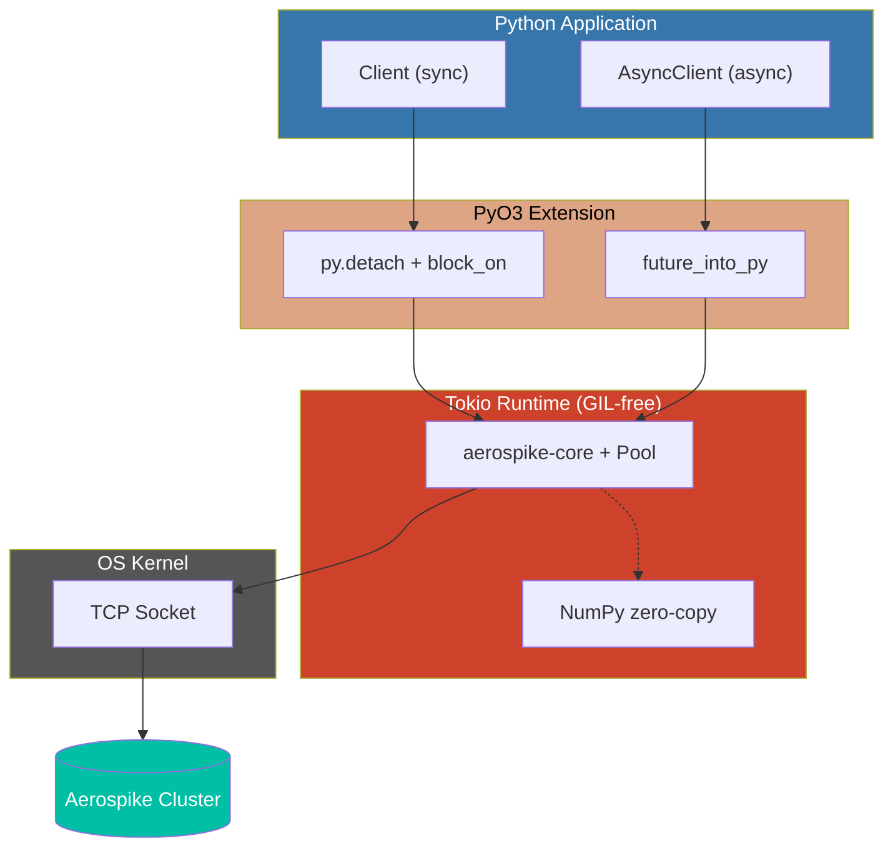

# Performance Overview

aerospike-py provides a high-performance Aerospike client based on the **Rust + PyO3 + Tokio** architecture.

## Architecture



### Key Design Decisions

- **GIL release strategy**: Both sync and async clients release the Python GIL before entering Rust I/O. Sync uses `py.detach()` + `RUNTIME.block_on()`, async uses `future_into_py()` returning a native Python awaitable. This allows other Python threads to run during network calls.

- **Single Tokio runtime**: A global multi-threaded Tokio runtime (`LazyLock`) is shared across all client instances. Sync client blocks on it, async client executes within it. Worker thread count defaults to the number of CPU cores.

- **Zero-copy NumPy path**: `batch_read(..., _dtype=dtype)` writes Aerospike values directly into a pre-allocated numpy structured array buffer via raw pointer writes — no intermediate Python objects are created per value.

  > `batch_read(keys, _dtype=dtype)` → Rust: `np.zeros(n, dtype)` → raw ptr writes (no GIL) → `NumpyBatchRecords`

- **Connection pooling**: Managed by `aerospike-core` with configurable `max_conns_per_node` and `idle_timeout`. The `Arc<AsClient>` is cheaply cloned per operation without holding locks.

## Benchmark Methodology

To ensure a fair comparison, we follow these principles:

1. **Warmup phase**: Pre-execution to stabilize connections and server caches (results excluded)
2. **Multiple rounds**: Multiple rounds per operation, reporting median of medians
3. **Pre-seeded data**: Data pre-loaded before read benchmarks
4. **GC disabled**: Python GC disabled during measurement intervals
5. **Isolated key prefixes**: Separate key prefixes for each client

## Comparison Targets

| Client | Language | Description |
|--------|----------|-------------|
| aerospike-py (sync) | Rust + Python | Synchronous API of this project |
| aerospike-py (async) | Rust + Python | Asynchronous API of this project |
| official aerospike | C + Python | [Official Aerospike C client](https://github.com/aerospike/aerospike-client-python) |

## Running Locally

### Basic Benchmark (console output only)

```bash
make run-benchmark
```

### Generate Report (MD + charts)

```bash
make run-benchmark-report
```

Generated files:
- `docs/docs/performance/benchmark-results.md` — Markdown report
- `docs/static/img/benchmark/*.svg` — 3 SVG charts

### Customizing Parameters

```bash
make run-benchmark BENCH_COUNT=10000 BENCH_ROUNDS=30 BENCH_CONCURRENCY=100
```

| Parameter | Default | Description |
|-----------|---------|-------------|
| `BENCH_COUNT` | 5,000 | Operations per round |
| `BENCH_ROUNDS` | 20 | Rounds per operation |
| `BENCH_CONCURRENCY` | 50 | Async concurrency level |
| `BENCH_BATCH_GROUPS` | 10 | Number of batch_read groups |

## Latest Results

See the [Benchmark Results](./benchmark-results) page for the latest benchmark results.

See the [NumPy Batch Benchmark](./numpy-benchmark-results) page for dict vs numpy batch_read comparison.
