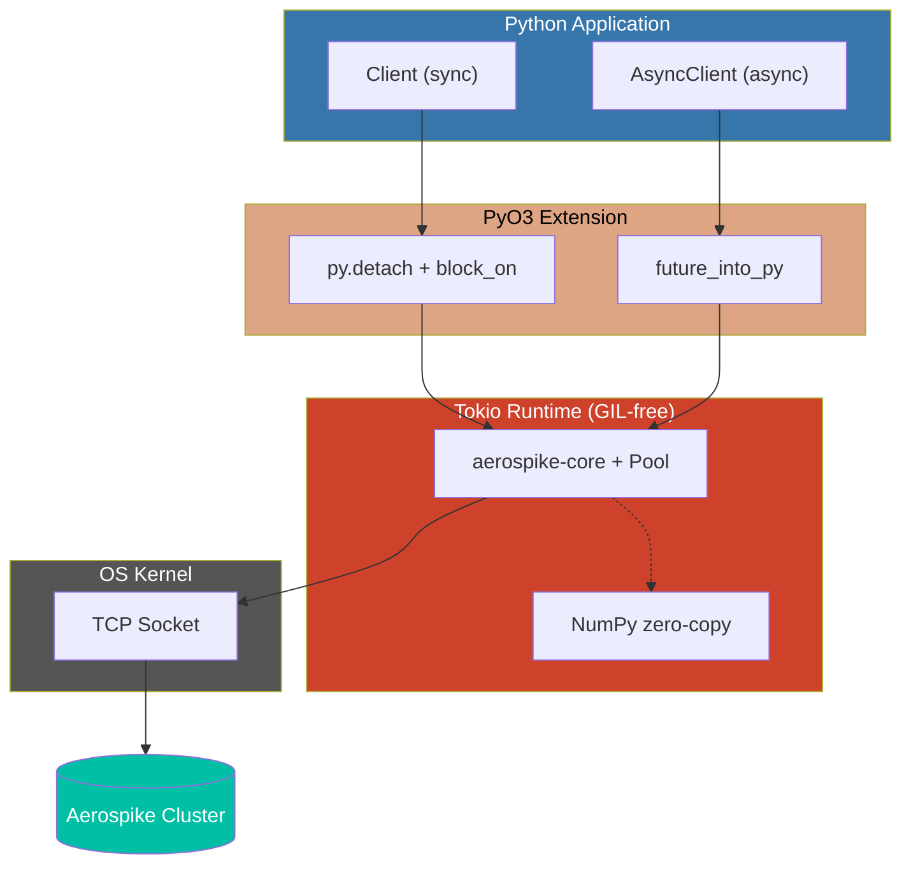

## Architecture



### Key Design

- **GIL release**: Both clients release GIL before Rust I/O. Sync uses `py.detach()` + `RUNTIME.block_on()`, async uses `future_into_py()`
- **Single Tokio runtime**: Global multi-threaded runtime shared across all clients. Worker threads = CPU cores
- **Zero-copy NumPy**: `batch_read(..., _dtype=dtype)` writes directly into numpy buffer via raw pointers -- no intermediate Python objects
- **Connection pooling**: Managed by `aerospike-core` with configurable `max_conns_per_node` and `idle_timeout`

## Benchmark Methodology

1. **Warmup phase** -- results excluded
2. **Multiple rounds** -- median of medians
3. **Pre-seeded data** for reads
4. **GC disabled** during measurement
5. **Isolated key prefixes** per client

## Comparison

| Client | Runtime |
|--------|---------|
| aerospike-py (sync) | Rust + Python |
| aerospike-py (async) | Rust + Python |
| official aerospike | C + Python |

## Running Benchmarks

```bash
make run-benchmark                # Console output
make run-benchmark-report         # MD report + SVG charts
```

```bash
# Custom parameters
make run-benchmark BENCH_COUNT=10000 BENCH_ROUNDS=30 BENCH_CONCURRENCY=100
```

| Parameter | Default | Description |
|-----------|---------|-------------|
| `BENCH_COUNT` | 5,000 | Operations per round |
| `BENCH_ROUNDS` | 20 | Rounds per operation |
| `BENCH_CONCURRENCY` | 50 | Async concurrency |
| `BENCH_BATCH_GROUPS` | 10 | Batch read groups |

## Results

- [Benchmark Results](./benchmark-results)
- [NumPy Batch Benchmark](./numpy-benchmark-results)
